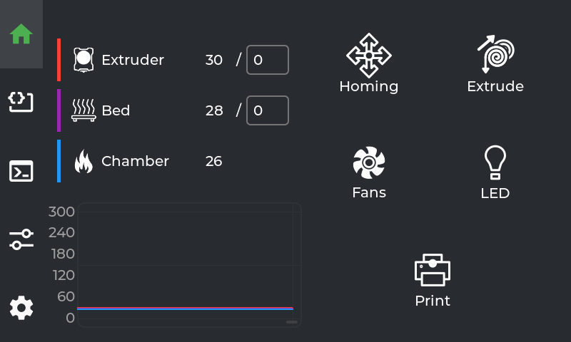
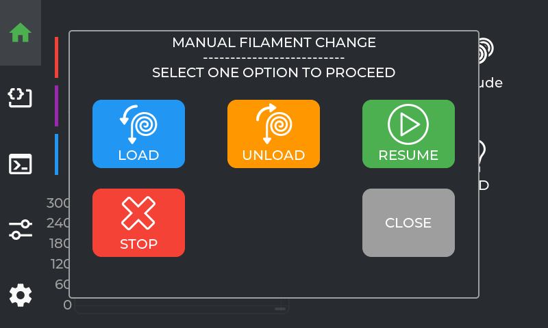
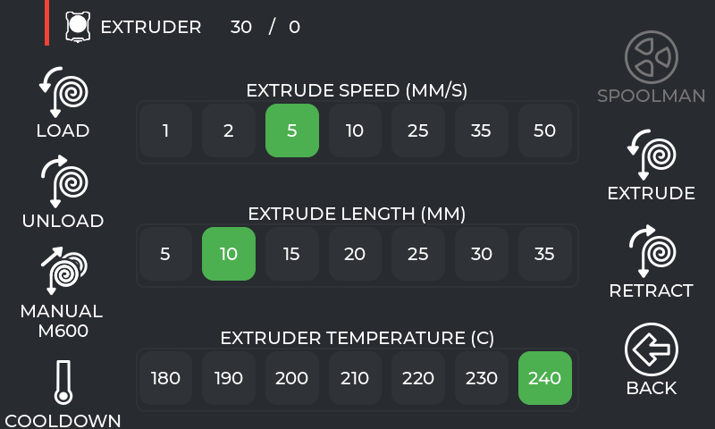
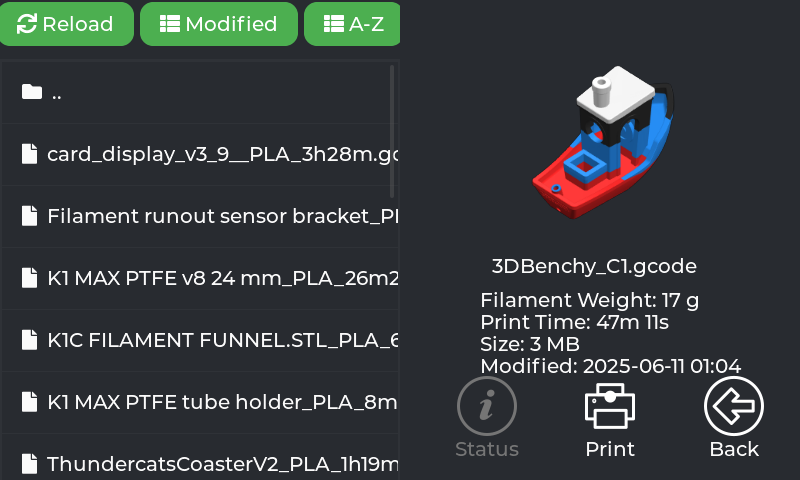
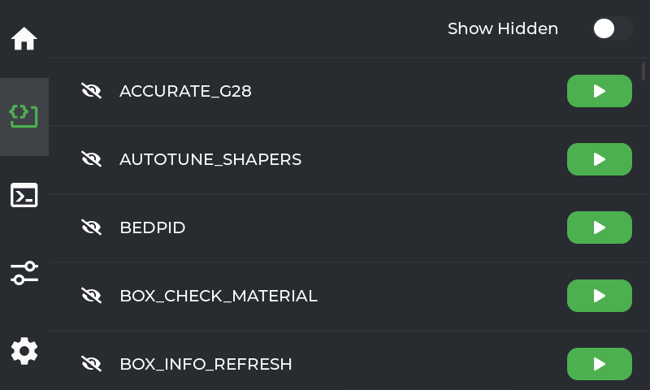
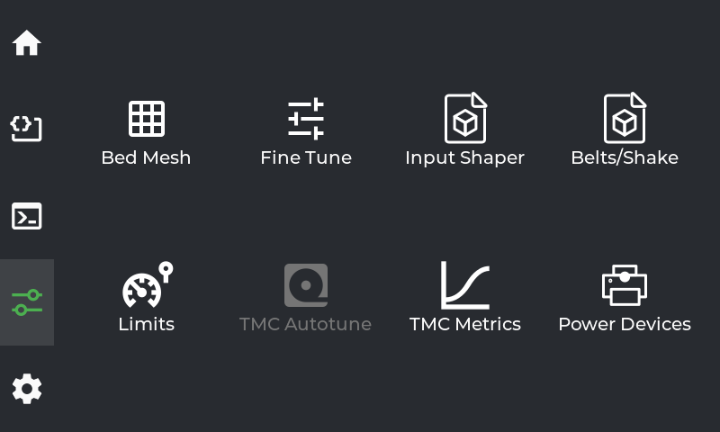
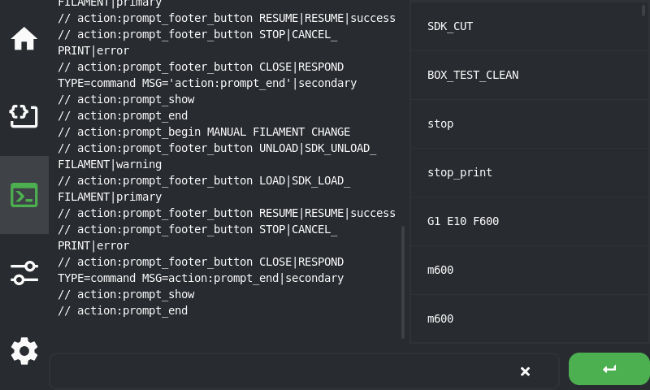
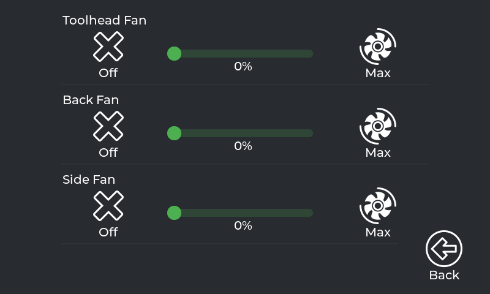

[English](#english) | [Español](#espanol)

---

<a name="english"></a>

# K1C CFS POWER SCREEN

This is a personal modification of PowerScreen focused exclusively on the Creality K1C. It keeps the touch interface base for Klipper/Moonraker and adds features specific to the CFS workflow and manual filament changes.

## Scope

This repository is intended only for:

- Creality K1C.
- The original K1C screen.
- MIPS builds compatible with K1C hardware.
- Custom CFS macros and scripts.

There are no builds, instructions, or support for Android, Raspberry Pi, `PowerScreenDroid`, or other printer models.

## Screenshots

The following captures were taken directly from a running K1C. They document the current interface and the custom CFS workflow; they are not historical screenshots from the original project.

| Main screen | Manual M600 dialog |
| --- | --- |
|  |  |

| Extrusion | Print and file list |
| --- | --- |
|  |  |

| Macros | Tune |
| --- | --- |
|  |  |

| Console | Fans |
| --- | --- |
|  |  |

The Settings capture will be added after the PowerScreen replacement so the documentation does not preserve outdated labels from the previous installation.

## Installation on a K1C

This is a manual SSH installation for the original K1C screen. Do not install while printing, heating, homing, or running a calibration. Keep the printer connected to stable power and keep the SSH session open until the final checks pass.

### Requirements

- A Creality K1C with SSH access enabled and reachable on the local network.
- A Windows PC with PowerShell and the OpenSSH `ssh`/`scp` commands.
- The file `powerscreen-zbolt.tar.gz` downloaded from the authenticated [GitHub Releases page](https://github.com/borferkic/K1C-CFS-POWER-SCREEN/releases).
- The root password of the printer.
- A verified backup before replacing an existing installation.

The only supported package is `powerscreen-zbolt.tar.gz`. It contains the MIPS executable, the service, the K1 macros and scripts, the themes, and the installer files. Do not use an ARM package or an archive from another printer model.

### 1. Verify the package on the PC

Run these commands in the directory containing the downloaded package:

```powershell
$PackagePath = ".\powerscreen-zbolt.tar.gz"
if (-not (Test-Path -LiteralPath $PackagePath)) { throw "Package not found: $PackagePath" }
Get-FileHash -LiteralPath $PackagePath -Algorithm SHA256
tar -tzf $PackagePath
```

The archive listing must include `powerscreen/powerscreen`, `powerscreen/installer.sh`, `powerscreen/update.sh`, `powerscreen/k1_mods/S99powerscreen`, and the `powerscreen/scripts/` directory. Stop if the archive is corrupt, has a different top-level directory, or is not the K1C MIPS package.

### 2. Create and verify a backup on the printer

Connect to the printer first:

```powershell
ssh -p 22 root@IP_DE_TU_K1C
```

At the printer shell, verify the architecture and available space. The architecture must be `mips`:

```sh
uname -m
df -h /usr/data
```

For an existing PowerScreen installation, create a dated backup before stopping or replacing it:

```sh
set -eu
BACKUP_ID=$(date +%Y%m%d-%H%M%S)
BACKUP_DIR=/usr/data/powerscreen-backups/pre-replace-$BACKUP_ID
mkdir -p "$BACKUP_DIR"

if [ -d /usr/data/powerscreen ]; then
    tar -czf "$BACKUP_DIR/powerscreen-install.tar.gz" -C /usr/data powerscreen
fi

if [ -f /etc/init.d/S99powerscreen ]; then
    cp -p /etc/init.d/S99powerscreen "$BACKUP_DIR/"
fi

if [ -f "$BACKUP_DIR/powerscreen-install.tar.gz" ]; then
    sha256sum "$BACKUP_DIR/powerscreen-install.tar.gz" > "$BACKUP_DIR/SHA256SUMS.txt"
    tar -tzf "$BACKUP_DIR/powerscreen-install.tar.gz" > /dev/null
fi

ls -lh "$BACKUP_DIR"
cat "$BACKUP_DIR/SHA256SUMS.txt" 2>/dev/null || true
echo "BACKUP_DIR=$BACKUP_DIR"
```

Do not continue until `tar -tzf` succeeds and the backup path has been recorded. Copy the archive to the PC as a second copy, replacing `<BACKUP_DIR>` with the path printed above:

```powershell
scp -P 22 root@IP_DE_TU_K1C:<BACKUP_DIR>/powerscreen-install.tar.gz .\powerscreen-backup.tar.gz
Get-FileHash -LiteralPath .\powerscreen-backup.tar.gz -Algorithm SHA256
```

The local hash must match the value in `SHA256SUMS.txt` on the printer. Keep this copy outside the active project tree or in a local backup folder that is not committed to Git.

### 3. Transfer the release package

Copy the verified package to `/tmp` on the K1C:

```powershell
scp -P 22 .\powerscreen-zbolt.tar.gz root@IP_DE_TU_K1C:/tmp/
```

Connect again and verify the transfer before extracting it:

```powershell
ssh -p 22 root@IP_DE_TU_K1C
```

```sh
uname -m
test "$(uname -m)" = "mips"
tar -tzf /tmp/powerscreen-zbolt.tar.gz > /dev/null
ls -lh /tmp/powerscreen-zbolt.tar.gz
```

### 4. Stage the package and run the installer

The installer configures more than the executable: it installs the service, macros, helper modules, scripts, shared libraries, and the configuration include. Therefore, use the bundled installer instead of copying only the binary.

Extract the package and run the installer:

```sh
tar -xzf /tmp/powerscreen-zbolt.tar.gz -C /usr/data/
test -x /usr/data/powerscreen/powerscreen
sh /usr/data/powerscreen/installer.sh
```

The installer may ask the following questions:

- If Moonraker is not connected, stop and fix Moonraker unless you intentionally choose to continue.
- Disabling all Creality services frees resources but can break Creality Cloud and Creality Slicer. Answer `n` if those services must remain available.
- Answer `y` when asked to restart Klipper so the new macros and modules are loaded.

The installer downloads the selected package from the repository's Releases channel. Use the `nightly` argument only when intentionally installing the development channel:

```sh
sh /usr/data/powerscreen/installer.sh nightly
```

Do not delete the backup or close the SSH session until the installer reports success and the checks in the next section pass.

### 5. Validate the installation

Run these checks on the printer:

```sh
test -x /usr/data/powerscreen/powerscreen
test -x /etc/init.d/S99powerscreen
/etc/init.d/S99powerscreen restart
sleep 2
ps | grep '[p]owerscreen'
tail -n 40 /usr/data/printer_data/logs/powerscreen.log
curl -s localhost:7125/server/info | jq .result.klippy_connected
grep -R "PowerScreen" /usr/data/printer_data/config/printer.cfg /usr/data/printer_data/config/PowerScreen 2>/dev/null
```

The process must remain active, the log must not show an immediate crash, and Moonraker must report `true` for `klippy_connected`. On the touchscreen, check the main tabs, open the extrusion panel, open the manual M600 dialog, and verify `LOAD`, `UNLOAD`, `RESUME`, `STOP`, and `CLOSE` individually. Test filament movement only with the correct temperature and a controlled filament path.

### 6. Rollback

If PowerScreen does not start, stop it and restore the verified archive from the backup directory. The exact backup directory is the one recorded during step 2. Restore the service file too, if it was included in the backup, then restart the service and validate the original state before attempting another upgrade.

The repository provides two release channels for the K1C. `nightly` is built automatically from `main` for development testing. `stable` is built when a version tag is created. Each channel contains the `powerscreen-zbolt.tar.gz` package. A successful GitHub Actions build is not the same as a published Release and is not, by itself, a hardware validation.

## Inherited features

- Console and macro shell.
- Bed Mesh.
- Input Shaper.
- Print status.
- Spoolman integration.
- Extrusion and retraction.
- Temperature control.
- Fan, LED, and movement control.
- Fine tuning for speed, flow, Z-offset, and Pressure Advance.
- Velocity and acceleration limits.
- File browser.
- TMC metrics.

## Additional features in this modification

- `MANUAL M600` button in the extrusion panel.
- Manual filament change dialog adapted to the K1C screen.
- `SDK_UNLOAD_FILAMENT` and `SDK_LOAD_FILAMENT` actions.
- Green `RESUME` action.
- Red `STOP` action using `CANCEL_PRINT`.
- `CLOSE` action to close the dialog.
- Icons for load, unload, resume, and stop actions.
- Button layout reorganized for comfortable touchscreen use on the K1C.

## Development and build

Initialize the submodules when cloning the repository:

```bash
git clone --recursive https://github.com/borferkic/K1C-CFS-POWER-SCREEN.git PowerScreen
cd PowerScreen
```

Building for the K1C requires the MIPS toolchain described in [DEVELOPMENT.md](DEVELOPMENT.md). The main configuration uses the `mipsel-buildroot-linux-musl-` compiler and generates:

```text
build/bin/powerscreen
```

Interface and CFS workflow testing must be performed on a real K1C. A successful build does not replace validation of the dialog, macros, or the extruder's physical behavior.

## Pending work

Internal change and pending logs are kept locally in `DEV LOG/` and are not included in the repository.
The project history is documented in [CHANGELOG.md](CHANGELOG.md).

## Support the project

If this project is useful to you, you can support its development through [PayPal](https://paypal.me/borissdk).

## Credits and thanks

This repository is maintained as K1C CFS POWER SCREEN and contains project-specific modifications for the Creality K1C.

The projects and resources used by the original foundation are also acknowledged:

- [LVGL](https://github.com/lvgl/lvgl)
- [Z-Bolt Icons](https://github.com/Z-Bolt/OctoScreen)
- [k1-discovery](https://github.com/ballaswag/k1-discovery) — MIPS toolchain and compatible `curl` helper used by the K1C workflow; thanks to `ballaswag`.
- [Moonraker](https://github.com/Arksine/moonraker)
- [KlipperScreen](https://github.com/KlipperScreen/KlipperScreen)
- [Fluidd](https://github.com/fluidd-core/fluidd)
- [Klippain Shake&Tune](https://github.com/Frix-x/klippain-shaketune)

## License

See [LICENSE](LICENSE) for the terms applicable to the original foundation and this modification.

---

<a name="espanol"></a>

# K1C CFS POWER SCREEN

Esta es una modificación personal de PowerScreen orientada exclusivamente a la Creality K1C. Mantiene la base de la interfaz táctil para Klipper/Moonraker y añade características específicas para el flujo CFS y el cambio manual de filamento.

## Alcance

Este repositorio está destinado únicamente a:

- Creality K1C.
- Pantalla original de la K1C.
- Compilación MIPS compatible con el hardware de la K1C.
- Macros y scripts personalizados para CFS.

No se incluyen builds, instrucciones ni soporte para Android, Raspberry Pi, `PowerScreenDroid` u otros modelos de impresora.

## Capturas de pantalla

Las siguientes capturas se tomaron directamente de una K1C en funcionamiento. Documentan la interfaz actual y el flujo CFS personalizado; no son capturas históricas del proyecto original.

| Pantalla principal | Diálogo M600 manual |
| --- | --- |
|  |  |

| Extrusión | Impresión y lista de archivos |
| --- | --- |
|  |  |

| Macros | Tune |
| --- | --- |
|  |  |

| Consola | Ventiladores |
| --- | --- |
|  |  |

La captura de `Settings` se añadirá después del reemplazo por PowerScreen para no conservar etiquetas antiguas de la instalación anterior.

## Instalación en una K1C

Esta es una instalación manual mediante SSH para la pantalla original de la K1C. No instales mientras la impresora esté imprimiendo, calentando, haciendo homing o ejecutando una calibración. Mantén la impresora conectada a una alimentación estable y conserva abierta la sesión SSH hasta terminar todas las comprobaciones.

### Requisitos

- Una Creality K1C con SSH habilitado y accesible desde la red local.
- Un PC Windows con PowerShell y los comandos OpenSSH `ssh`/`scp`.
- El archivo `powerscreen-zbolt.tar.gz` descargado desde la [página autenticada de GitHub Releases](https://github.com/borferkic/K1C-CFS-POWER-SCREEN/releases).
- La contraseña root de la impresora.
- Un respaldo verificado antes de reemplazar una instalación existente.

El único paquete compatible es `powerscreen-zbolt.tar.gz`. Contiene el ejecutable MIPS, el servicio, las macros y scripts de la K1C, los temas y los archivos del instalador. No uses un paquete ARM ni un archivo de otro modelo de impresora.

### 1. Verificar el paquete en el PC

Ejecuta estos comandos en la carpeta que contiene el paquete descargado:

```powershell
$PackagePath = ".\powerscreen-zbolt.tar.gz"
if (-not (Test-Path -LiteralPath $PackagePath)) { throw "No se encontró el paquete: $PackagePath" }
Get-FileHash -LiteralPath $PackagePath -Algorithm SHA256
tar -tzf $PackagePath
```

El listado debe incluir `powerscreen/powerscreen`, `powerscreen/installer.sh`, `powerscreen/update.sh`, `powerscreen/k1_mods/S99powerscreen` y la carpeta `powerscreen/scripts/`. Detente si el archivo está dañado, tiene otra carpeta raíz o no corresponde al paquete MIPS de la K1C.

### 2. Crear y verificar el respaldo en la impresora

Conéctate primero a la impresora:

```powershell
ssh -p 22 root@IP_DE_TU_K1C
```

En la consola de la impresora verifica la arquitectura y el espacio disponible. La arquitectura debe ser `mips`:

```sh
uname -m
df -h /usr/data
```

Si ya existe una instalación de PowerScreen, crea un respaldo fechado antes de detenerla o reemplazarla:

```sh
set -eu
BACKUP_ID=$(date +%Y%m%d-%H%M%S)
BACKUP_DIR=/usr/data/powerscreen-backups/pre-replace-$BACKUP_ID
mkdir -p "$BACKUP_DIR"

if [ -d /usr/data/powerscreen ]; then
    tar -czf "$BACKUP_DIR/powerscreen-install.tar.gz" -C /usr/data powerscreen
fi

if [ -f /etc/init.d/S99powerscreen ]; then
    cp -p /etc/init.d/S99powerscreen "$BACKUP_DIR/"
fi

if [ -f "$BACKUP_DIR/powerscreen-install.tar.gz" ]; then
    sha256sum "$BACKUP_DIR/powerscreen-install.tar.gz" > "$BACKUP_DIR/SHA256SUMS.txt"
    tar -tzf "$BACKUP_DIR/powerscreen-install.tar.gz" > /dev/null
fi

ls -lh "$BACKUP_DIR"
cat "$BACKUP_DIR/SHA256SUMS.txt" 2>/dev/null || true
echo "BACKUP_DIR=$BACKUP_DIR"
```

No continúes hasta que `tar -tzf` termine correctamente y hayas anotado la ruta del respaldo. Copia el archivo al PC como segunda copia, sustituyendo `<BACKUP_DIR>` por la ruta que se mostró:

```powershell
scp -P 22 root@IP_DE_TU_K1C:<BACKUP_DIR>/powerscreen-install.tar.gz .\powerscreen-backup.tar.gz
Get-FileHash -LiteralPath .\powerscreen-backup.tar.gz -Algorithm SHA256
```

El hash local debe coincidir con el valor de `SHA256SUMS.txt` de la impresora. Conserva esta copia fuera del árbol activo del proyecto o dentro de una carpeta local de respaldos que no se suba a Git.

### 3. Transferir el paquete de release

Copia el paquete verificado a `/tmp` de la K1C:

```powershell
scp -P 22 .\powerscreen-zbolt.tar.gz root@IP_DE_TU_K1C:/tmp/
```

Conéctate de nuevo y verifica la transferencia antes de extraerla:

```powershell
ssh -p 22 root@IP_DE_TU_K1C
```

```sh
uname -m
test "$(uname -m)" = "mips"
tar -tzf /tmp/powerscreen-zbolt.tar.gz > /dev/null
ls -lh /tmp/powerscreen-zbolt.tar.gz
```

### 4. Preparar el paquete y ejecutar el instalador

El instalador configura más que el ejecutable: instala el servicio, las macros, los módulos auxiliares, los scripts, las bibliotecas compartidas y el include de configuración. Por eso debes usar el instalador incluido y no copiar únicamente el binario.

Extrae el paquete y ejecuta el instalador:

```sh
tar -xzf /tmp/powerscreen-zbolt.tar.gz -C /usr/data/
test -x /usr/data/powerscreen/powerscreen
sh /usr/data/powerscreen/installer.sh
```

El instalador puede hacer estas preguntas:

- Si Moonraker no está conectado, detente y corrige Moonraker salvo que tengas un motivo concreto para continuar.
- Deshabilitar todos los servicios de Creality libera recursos, pero puede romper Creality Cloud y Creality Slicer. Responde `n` si necesitas conservar esos servicios.
- Responde `y` cuando solicite reiniciar Klipper para cargar las nuevas macros y módulos.

El instalador descarga el paquete seleccionado desde el canal Releases del repositorio. Usa el argumento `nightly` únicamente si quieres instalar de forma intencional el canal de desarrollo:

```sh
sh /usr/data/powerscreen/installer.sh nightly
```

No borres el respaldo ni cierres la sesión SSH hasta que el instalador informe éxito y las comprobaciones de la siguiente sección pasen.

### 5. Validar la instalación

Ejecuta estas comprobaciones en la impresora:

```sh
test -x /usr/data/powerscreen/powerscreen
test -x /etc/init.d/S99powerscreen
/etc/init.d/S99powerscreen restart
sleep 2
ps | grep '[p]owerscreen'
tail -n 40 /usr/data/printer_data/logs/powerscreen.log
curl -s localhost:7125/server/info | jq .result.klippy_connected
grep -R "PowerScreen" /usr/data/printer_data/config/printer.cfg /usr/data/printer_data/config/PowerScreen 2>/dev/null
```

El proceso debe mantenerse activo, el log no debe mostrar un cierre inmediato y Moonraker debe responder `true` en `klippy_connected`. En la pantalla táctil revisa las pestañas principales, abre el panel de extrusión, abre el diálogo M600 manual y verifica individualmente `LOAD`, `UNLOAD`, `RESUME`, `STOP` y `CLOSE`. Prueba el movimiento de filamento únicamente con la temperatura correcta y el recorrido preparado.

### 6. Reversión

Si PowerScreen no inicia, detenlo y restaura el archivo verificado desde la carpeta de respaldo. Usa exactamente la carpeta anotada en el paso 2. Restaura también el archivo de servicio si fue incluido en el respaldo, reinicia el servicio y valida el estado anterior antes de intentar otra actualización.

El repositorio ofrece dos canales para la K1C. `nightly` se compila automáticamente desde `main` para pruebas de desarrollo. `stable` se compila al crear un tag de versión. Cada canal contiene `powerscreen-zbolt.tar.gz`. Una compilación exitosa de GitHub Actions no equivale a una Release publicada ni valida por sí sola el funcionamiento en hardware.

## Características heredadas

- Consola y shell de macros.
- Bed Mesh.
- Input Shaper.
- Estado de impresión.
- Integración con Spoolman.
- Extrusión y retracción.
- Control de temperaturas.
- Control de ventiladores, LED y movimiento.
- Ajuste fino de velocidad, flujo, Z-offset y Pressure Advance.
- Límites de velocidad y aceleración.
- Explorador de archivos.
- Métricas TMC.

## Características adicionales de esta modificación

- Botón `MANUAL M600` en el panel de extrusión.
- Diálogo de cambio manual de filamento adaptado a la pantalla de la K1C.
- Acciones `SDK_UNLOAD_FILAMENT` y `SDK_LOAD_FILAMENT`.
- Acción `RESUME` en color verde.
- Acción `STOP` en color rojo mediante `CANCEL_PRINT`.
- Acción `CLOSE` para cerrar el diálogo.
- Iconos para las acciones de carga, descarga, reanudación y detención.
- Botones reorganizados para facilitar el uso táctil en la K1C.

## Desarrollo y compilación

Los submódulos deben inicializarse al clonar el repositorio:

```bash
git clone --recursive https://github.com/borferkic/K1C-CFS-POWER-SCREEN.git PowerScreen
cd PowerScreen
```

La compilación para la K1C requiere el toolchain MIPS indicado en [DEVELOPMENT.md](DEVELOPMENT.md). La configuración principal usa el compilador `mipsel-buildroot-linux-musl-` y genera:

```text
build/bin/powerscreen
```

Las pruebas de interfaz y del flujo CFS deben realizarse en una K1C real. Una compilación correcta no sustituye la validación del diálogo, las macros ni el comportamiento físico del extrusor.

## Pendientes

Los registros internos de cambios y pendientes se guardan localmente en `DEV LOG/` y no se incluyen en el repositorio.
El historial del proyecto se documenta en [CHANGELOG.md](CHANGELOG.md).

## Apoyo al proyecto

Si este proyecto te resulta útil, puedes apoyar su desarrollo mediante [PayPal](https://paypal.me/borissdk).

## Créditos y agradecimientos

Este repositorio se mantiene como K1C CFS POWER SCREEN e incluye modificaciones específicas para la Creality K1C.

También se reconocen los proyectos y recursos utilizados por la base original:

- [LVGL](https://github.com/lvgl/lvgl)
- [Z-Bolt Icons](https://github.com/Z-Bolt/OctoScreen)
- [k1-discovery](https://github.com/ballaswag/k1-discovery) — toolchain MIPS y helper `curl` compatible usados por el flujo de la K1C; agradecimiento a `ballaswag`.
- [Moonraker](https://github.com/Arksine/moonraker)
- [KlipperScreen](https://github.com/KlipperScreen/KlipperScreen)
- [Fluidd](https://github.com/fluidd-core/fluidd)
- [Klippain Shake&Tune](https://github.com/Frix-x/klippain-shaketune)

## Licencia

Consulta [LICENSE](LICENSE) para conocer los términos aplicables a la base original y a esta modificación.
